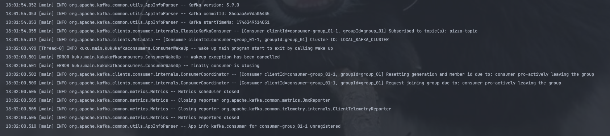

### 카프카 컨슈머 정리

1. wakeup 종료

graceful 하게 종료된다
- Resetting generation and member id due to: consumer pro-actively leaving the group

2. docker-compose 파일 수정
   https://medium.com/@underwater2/docker-compose%EB%A1%9C-kafka-cluster-%EA%B5%AC%EC%84%B1%ED%95%98%EA%B8%B0-10863606c526

consumer 에 있는 docker-compose 로 실행시키기
producer 에 있는 것은 안됨 