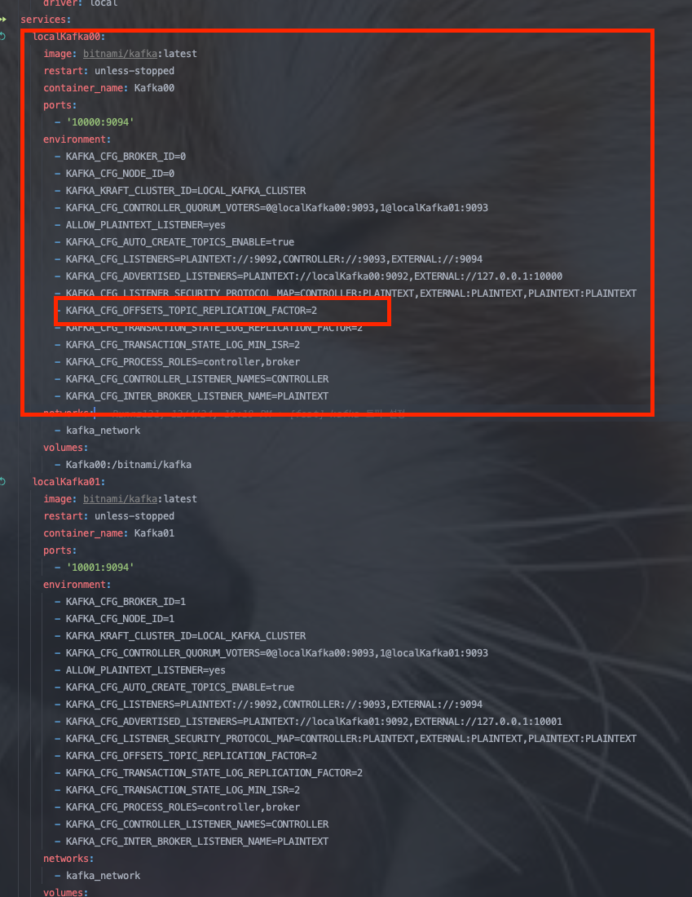

### 카프카 컨슈머 정리

1. wakeup 종료

graceful 하게 종료된다
- Resetting generation and member id due to: consumer pro-actively leaving the group

2. docker-compose 파일 수정
   https://medium.com/@underwater2/docker-compose%EB%A1%9C-kafka-cluster-%EA%B5%AC%EC%84%B1%ED%95%98%EA%B8%B0-10863606c526

### 트러블 슈팅

- producer 는 전송 되나, consumer 에서 메시지 컨슈밍 못함
- 원인 : 브로커 2대인데 복제 파티션 3개로 설정해서 발생

- KAFKA_CFG_OFFSETS_TOPIC_REPLICATION_FACTOR 옵션의 맵핑되는 kafka 설정은 offsets.topic.replication.factor 이다.
- 해당 옵션의 역할은 생성될 때 사용할 replication factor(복제본 수)를 정의 한다.
- Replication factor > 브로커 수 → Kafka 컨트롤러가 “원하는 복제본 수를 맞출 수 없다”고 판단하고 토픽 생성을 거부하여 발생 